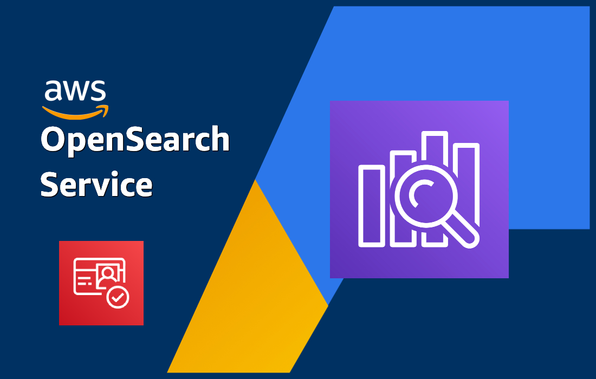
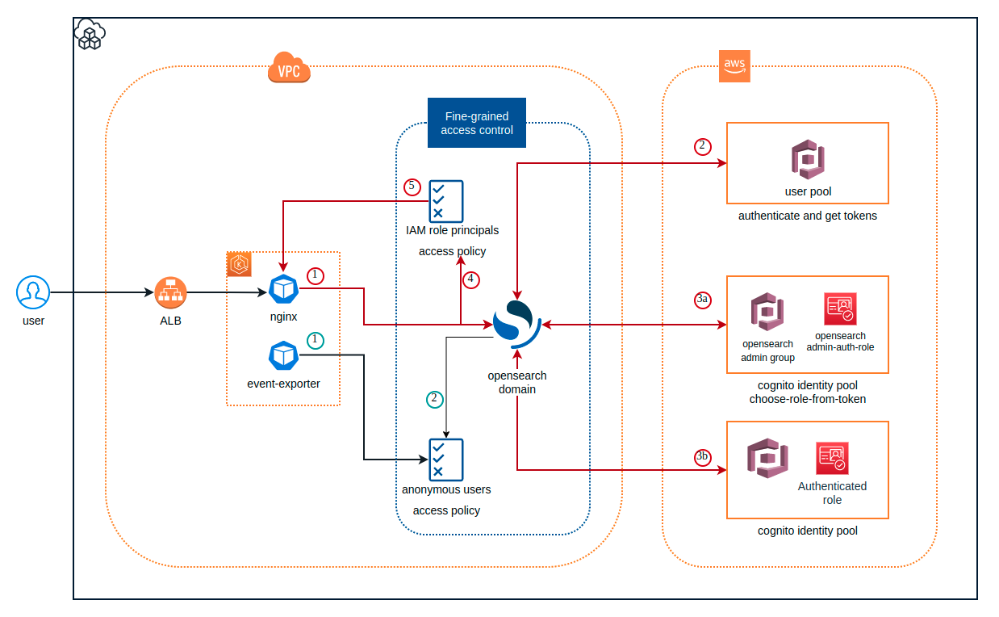

<p align="center">
  <a href="https://dev.to/vumdao">
    
  </a>
</p>
<h1 align="center">
  <div><b>Access Control And OpenSearch Service Security</b></div>
</h1>

## Abstract
- For the quick start of building opensearch, we can put the opensearch in public network and control access by using basic authentication and domain access policy from Fine-grain access controller. But this is a Critical alert from AWS security standard.
- [[OpenSearch.2] OpenSearch domains should be in a VPC](https://docs.aws.amazon.com/securityhub/latest/userguide/securityhub-standards-fsbp-controls.html#opensearch-2-remediation)
- In this blog, I will walk through create opensearch domain, put it in VPC and how to use NGINX proxy to access OpenSearch Dashboards from outside a VPC that's using Amazon Cognito authentication
- All AWS resources and settings are done by Cloud development toolkit (CDK-typescript)

<p align="center">

</p>

## Table Of Contents
 * [Create opensearch domain](#Create-opensearch-domain)
 * [Enable Amazon Cognito authentication](#Enable-Amazon-Cognito-authentication)
 * [Fine-grained access control](#Fine-grained-access-control)
 * [The overall architecture](#The-overall-architecture)
 * [Conclusion](#Conclusion)

---

## 🚀 **Create opensearch domain** <a name="Create-opensearch-domain"></a>
- The opensearch domain is created with VPC and security group which only allow private network access
- For testing purpose, this code creates opensearch cluster with one node only, restrict 1 AZ with 1 subnet

  ```
    const prefix = 'dev-opensearch';

    const osVpc = new Vpc(this, `${prefix}-vpc`, {
      vpcName: prefix,
      natGateways: 1
    });

    const osSg = new SecurityGroup(this, `${prefix}-sg`, {
      securityGroupName: `${prefix}-sg`,
      vpc: osVpc
    });

    const osDomain = new Domain(this, domainName, {
      domainName: domainName,
      version: EngineVersion.OPENSEARCH_1_2,
      removalPolicy: RemovalPolicy.DESTROY,
      enableVersionUpgrade: true,
      vpc: osVpc,
      vpcSubnets: [{
        availabilityZones: [`${this.region}a`],
        onePerAz: true
      }],
      securityGroups: [osSg],
      capacity: {
        dataNodes: 1,
        dataNodeInstanceType: 't3.small.search',
      },
      ebs: {
        volumeSize: 10,
        volumeType: EbsDeviceVolumeType.GENERAL_PURPOSE_SSD,
      },
  ```

## 🚀 **Enable Amazon Cognito authentication** <a name="Enable-Amazon-Cognito-authentication"></a>
- This step configures Amazon OpenSearch Service to use Amazon Cognito authentication for OpenSearch Dashboards
- Using **Amazon Cognito authentication** requires cognito user pool and cognito identity pool.
- Furthermore, we need to attach a role which gives Amazon OpenSearch Service permissions to configure the Amazon Cognito user and identity pools and use them for OpenSearch Dashboards/Kibana authentication. It is separate from the IAM role that allows users access to OpenSearch Dashboards/Kibana after they log in. A role with this name will be created in your account with the permissions defined in the role policy. If a role with this name already exists, it will be used to configure Cognito.
- With that role, opensearch automatically create user pool application for authentication
  

- CDK code
  - opensearch role for consuming AWS cognito, it only needes the policy `AmazonOpenSearchServiceCognitoAccess`

    ```
    const cognitoOpensearchRole = new Role(this, 'dev-CognitoAccessForAmazonOpenSearch', {
      roleName: 'dev-CognitoAccessForAmazonOpenSearch',
      assumedBy: new ServicePrincipal('opensearchservice.amazonaws.com'),
      managedPolicies: [{managedPolicyArn: 'arn:aws:iam::aws:policy/AmazonOpenSearchServiceCognitoAccess'}]
    });
    ```

  - Create user pool

    ```
    const prefix = 'dev-opensearch';

    const userpool = new UserPool(this, `${prefix}-userpool`, {
      userPoolName: `${prefix}-userpool`,
      signInAliases: { username: false, email: true },
      standardAttributes: { email: { required: true } },
      removalPolicy: RemovalPolicy.DESTROY,
      selfSignUpEnabled: true
    });

    userpool.addDomain(`${prefix}-domain`, {
      cognitoDomain: { domainPrefix: 'devos' },
    });
    ```

  - Create identity pool, it's important to set `allowUnauthenticatedIdentities: true`

    ```
    const identityPool = new IdentityPool(this, `${prefix}-identity-pool`, {
      identityPoolName: `${prefix}-identity`,
      allowUnauthenticatedIdentities: true
    });
    ```

  - Enable Amazon Cognito authentication in opensearch, add following code to the above opensearch domain stack

    ```
      cognitoDashboardsAuth: {
        identityPoolId: identityPool.identityPoolId,
        userPoolId: userpool.userPoolId,
        role: cognitoOpensearchRole
      },
    ```

  

## 🚀 **Fine-grained access control** <a name="Fine-grained-access-control"></a>
- [The bigger picture: fine-grained access control and OpenSearch Service security](https://docs.amazonaws.cn/en_us/opensearch-service/latest/developerguide/fgac.html)

  

- With VPC and Fine-grained access control enabled, we enable 3 layers of security for opensearch those are Network, Domain access policy and Fine-grained access control.
- We're familar with **VPC** that's why the main point of this blog is using nginx to access opensearch dashboard from outside of VPC
- **Domain access policy**: After a request reaches a domain endpoint, the resource-based access policy allows or denies the request access to a given URI. In following code, it separats 3 group users: default IAM role which is used by cognito identity pool, admin role (TBD) and anonymous user which only have some API request permission on specific index. Following is the code snippet to create domain access policy according to the 3 group users mentioned above.

  ```
  accessPolicies: [
        new PolicyStatement({
          actions: ['es:ESHttpGet', 'es:ESHttpPost'],
          resources: [`arn:aws:es:${this.region}:${this.account}:domain/${domainName}/*`],
          principals: [new ArnPrincipal(identityPool.authenticatedRole.roleArn)],
        }),
        new PolicyStatement({
          actions: ['es:*'],
          resources: [`arn:aws:es:${this.region}:${this.account}:domain/${domainName}/*`],
          principals: [new ArnPrincipal(adminAuthRole.roleArn)],
        }),

        /**
         * Support anonymous user
         * Some application/tool such as Kubernetes Event Exporter does not support IRSA but using basic authentication.
         * For using opensearch as a recevier, the tool just supports to use username/password
         * to communicate with opensearch domain, not support IRSA as aws-for-fluent-bit yet
         * Checkout: https://github.com/resmoio/kubernetes-event-exporter/issues/8
         */
        new PolicyStatement({
          actions: [
            "es:ESHttpDelete",
            "es:ESHttpPost",
            "es:ESHttpPut",
            "es:ESHttpPatch"
          ],
          resources: [`arn:aws:es:${this.region}:${this.account}:domain/${domainName}/kube-events*`],
          principals: [new AnyPrincipal()],
        })
      ]
  ```

- **Fine-grained access control**: We enable and use this to add IAM role ARN and/or master user. After a resource-based access policy allows a request to reach a domain endpoint, fine-grained access control evaluates the user credentials and either authenticates the user or denies the request.

  ```
  fineGrainedAccessControl: {
        masterUserArn: identityPool.authenticatedRole.roleArn
      },
  ```

  - From CDK stack lib, we can only add one IAM ARN but we can add more later manually as it says opensearch will not delete the old master user when adding new one

  

  - We call master user, but keep in mind that, the `domain access policy` define which actions the user can perform in opensearch

## 🚀 **The overall architecture** <a name="The-overall-architecture"></a>
<p align="center">
  
</p>

- There are two main flows you see here which is request from `nginx` and request from the `kube-event-exporter`.

### **1. Nginx proxy to access opensearch dashboard**
- The nginx, here is k8s pod, which is in same VPC network of the opensearch and allowed traffics based on network interface of Security group
- After reaching opensearch domain, the request (not have access token yet) is redirected by opensearch to cognito user pool domain for signing. If signing successfully opensearch bases on role based access policy to handle the request. BUT which role is attached to the logined user?
- In practice, we need to seperate Developer user and admin user, that's why we see there're two cases for exchanging tokens from the architect

  1. **Developer user**
    - If we just deploy the cdk code above, no more setup, the the user eg. `developer@cloudopz.co` assumes the default role from cognito identity pool
      

    - Authenticated role: the role does not have any permission as it will assume the domain access policy
      

      ```
      {
        "Effect": "Allow",
        "Principal": {
          "AWS": "arn:aws:iam::123456789012:role/DevOpensearchClusterStack-devopensearchidentitypoo-2P7KIXVTH8NT"
        },
        "Action": [
          "es:ESHttpGet",
          "es:ESHttpPost"
        ],
        "Resource": "arn:aws:es:ap-southeast-1:123456789012:domain/dev-opensearch/*"
      },
      ```
  2. **Admin role**: In order to let a user from user pool assume another role which is allowed more power permission, following steps are required.
       1. Add the user `vu.dao@cloudopz.co` to `opensearch-admin-group` group which is created by CDK and this group is associated with the role `arn:aws:iam::123456789012:role/dev-opensearch-admin-auth-role`, remember to set the `Precedence` to `0` as the most priority of providing token method

          
       2. Update cognito identity pool to prioritize `Choose role from token` as the first option prior to the default one

          

          The user `vu.dao@cloudopz.co` will assume the role `arn:aws:iam::123456789012:role/dev-opensearch-admin-auth-role` which has the following access policy
          ```
            {
              "Effect": "Allow",
              "Principal": {
                "AWS": "arn:aws:iam::123456789012:role/dev-opensearch-admin-auth-role"
              },
              "Action": "es:*",
              "Resource": "arn:aws:es:ap-southeast-1:123456789012:domain/dev-opensearch/*"
            }
          ```
- All the AWS resources are on the right track, now let's have a look at nginx config (remember to replace `domain-endpoint` with opensearch endpoint and `cognito_host` with Amazon Cognito domain)
  ```
    opensearch-nginx/
    ├── conf.d
    │   └── default.conf
    ├── Dockerfile
    └── nginx.conf
  ```

### 2. **Anonymous user**
- It's not a problem for using tool such as [aws-for-fluent-bit](https://github.com/aws/aws-for-fluent-bit) which supports IRSA (IAM role for service account) and we just need to annotate a role to serviceAccount of `aws-for-fluent-bit` and then add that role to opensearch using fine-grained access control
- But for other tools such as `kube-event-exporter` which has not supported signing-service requests, so we can solve this by adding anonymous user with limit resource for specific index
  ```
    {
      "Effect": "Allow",
      "Principal": {
        "AWS": "*"
      },
      "Action": [
        "es:ESHttpDelete",
        "es:ESHttpPost",
        "es:ESHttpPut",
        "es:ESHttpPatch"
      ],
      "Resource": "arn:aws:es:ap-southeast-1:123456789012:domain/dev-opensearch/kube-events*"
    }
  ```

- Let's check the result

  

## 🚀 **Conclusion** <a name="Conclusion"></a>
- Congratulations! TL;DR
- In general, put opensearch domain in VPC, enable fine-grained access control and manage domain access policy are not much challenge. The things is how we can access the domain outside of VPC and separate the developer and admin users by leveraging cognito user pool and identiy pool.

---

References:
- https://aws.amazon.com/premiumsupport/knowledge-center/opensearch-outside-vpc-nginx/
- https://aws.amazon.com/premiumsupport/knowledge-center/opensearch-dashboards-authentication/
- https://docs.aws.amazon.com/opensearch-service/latest/developerguide/cognito-auth.html#cognito-auth-config
- https://aws.amazon.com/blogs/database/get-started-with-amazon-elasticsearch-service-use-amazon-cognito-for-kibana-access-control/
- https://docs.aws.amazon.com/opensearch-service/latest/developerguide/handling-errors.html

---

<h3 align="center">
  <a href="https://dev.to/vumdao">:stars: Blog</a>
  <span> · </span>
  <a href="https://github.com/vumdao/aws-vpc-opensearch/">Github</a>
  <span> · </span>
  <a href="https://stackoverflow.com/users/11430272/vumdao">stackoverflow</a>
  <span> · </span>
  <a href="https://www.linkedin.com/in/vu-dao-9280ab43/">Linkedin</a>
  <span> · </span>
  <a href="https://www.linkedin.com/groups/12488649/">Group</a>
  <span> · </span>
  <a href="https://www.facebook.com/CloudOpz-104917804863956">Page</a>
  <span> · </span>
  <a href="https://twitter.com/VuDao81124667">Twitter :stars:</a>
</h3>
